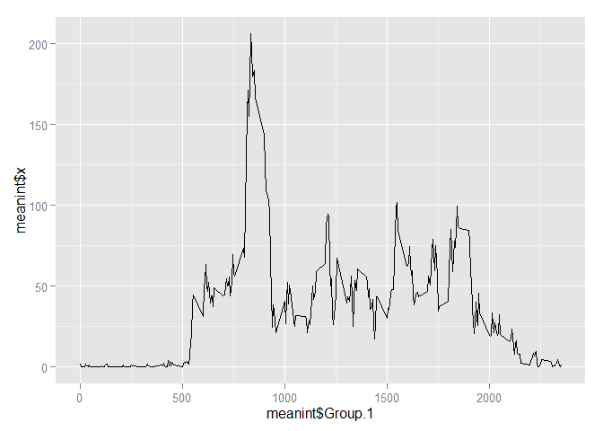

Loading and preprocessing the data
----------------------------------

Show any code that is needed to

Load the data (i.e. read.csv())

Process/transform the data (if necessary) into a format suitable for
your analysis

    activity<-read.csv("activity.csv")
    head(activity)

    ##   steps       date interval
    ## 1    NA 2012-10-01        0
    ## 2    NA 2012-10-01        5
    ## 3    NA 2012-10-01       10
    ## 4    NA 2012-10-01       15
    ## 5    NA 2012-10-01       20
    ## 6    NA 2012-10-01       25

    library(ggplot2)

What is mean total number of steps taken per day?
-------------------------------------------------

For this part of the assignment, you can ignore the missing values in
the dataset.

Calculate the total number of steps taken per day

If you do not understand the difference between a histogram and a
barplot, research the difference between them. Make a histogram of the
total number of steps taken each day

Calculate and report the mean and median of the total number of steps
taken per day

    meansteps<-aggregate(activity$steps,list(activity$date),sum)

Plot

    a<-ggplot(meansteps,aes(meansteps$x))   +
        geom_histogram(na.rm=TRUE)
    a

    ## stat_bin: binwidth defaulted to range/30. Use 'binwidth = x' to adjust this.

Mean and Median

    mean(meansteps$x,na.rm=TRUE)

    ## [1] 10766.19

    median(meansteps$x,na.rm=TRUE)

    ## [1] 10765

What is the average daily activity pattern?
-------------------------------------------

Make a time series plot (i.e. type = "l") of the 5-minute interval
(x-axis) and the average number of steps taken, averaged across all days
(y-axis)

Which 5-minute interval, on average across all the days in the dataset,
contains the maximum number of steps?

    meanint<-aggregate(activity$steps,list(activity$interval),mean,na.rm=TRUE)
    #       head(meanint)

    b<-ggplot(meanint,aes(x=meanint$Group.1,y=meanint$x))   +
        geom_line()

    b

    #       Max Value

    meanint[meanint$x==max(meanint$x),1]

    ## [1] 835

Imputing missing values
=======================

Strategy used replaces NAs with the average for that time interval
across observed period

Note that there are a number of days/intervals where there are missing
values (coded as NA). The presence of missing days may introduce bias
into some calculations or summaries of the data.

Calculate and report the total number of missing values in the dataset
(i.e. the total number of rows with NAs)

Devise a strategy for filling in all of the missing values in the
dataset. The strategy does not need to be sophisticated. For example,
you could use the mean/median for that day, or the mean for that
5-minute interval, etc.

Create a new dataset that is equal to the original dataset but with the
missing data filled in.

Make a histogram of the total number of steps taken each day and
Calculate and report the mean and median total number of steps taken per
day. Do these values differ from the estimates from the first part of
the assignment? What is the impact of imputing missing data on the
estimates of the total daily number of steps?

    #       Count NAs
    sum(is.na(activity$steps))

    ## [1] 2304

    #       Replace NA Values with average for that time
    library("plyr")
    library("ggplot2")
    activityNew<-activity
    NAs<-is.na(activityNew$steps)
    avg<-tapply(activityNew$steps, activityNew$interval,mean,
                na.rm=TRUE, simplify = TRUE)
    activityNew$steps[NAs]<-avg[as.character(activityNew$interval[NAs])]

    #       Double check NAs removed

    sum(is.na(activityNew$steps))

    ## [1] 0

    #       Histogram

    meanstepsNew<-aggregate(activityNew$steps,list(activity$date),sum)
    c<-ggplot(meanstepsNew,aes(meanstepsNew$x))   +
        geom_histogram(na.rm=TRUE)
    c

    ## stat_bin: binwidth defaulted to range/30. Use 'binwidth = x' to adjust this.

    #       Mean and Media

    mean(meanstepsNew$x,na.rm=TRUE)

    ## [1] 10766.19

    median(meanstepsNew$x,na.rm=TRUE)

    ## [1] 10766.19

    #       mean remains unchanged, median now matches mean
    #       Total number of steps goes up?
    sum(activityNew$steps)-sum(activity$steps, na.rm=TRUE)

    ## [1] 86129.51

Are there differences in activity patterns between weekdays and weekends
------------------------------------------------------------------------

For this part the weekdays() function may be of some help here. Use the
dataset with the filled-in missing values for this part.

Create a new factor variable in the dataset with two levels - "weekday"
and "weekend" indicating whether a given date is a weekday or weekend
day.

Make a panel plot containing a time series plot (i.e. type = "l") of the
5-minute interval (x-axis) and the average number of steps taken,
averaged across all weekday days or weekend days (y-axis). See the
README file in the GitHub repository to see an example of what this plot
should look like using simulated data.

    library("dplyr")

    ## 
    ## Attaching package: 'dplyr'
    ## 
    ## The following objects are masked from 'package:plyr':
    ## 
    ##     arrange, count, desc, failwith, id, mutate, rename, summarise,
    ##     summarize
    ## 
    ## The following object is masked from 'package:stats':
    ## 
    ##     filter
    ## 
    ## The following objects are masked from 'package:base':
    ## 
    ##     intersect, setdiff, setequal, union

    activityW<-activityNew
    activityW$weekday<-weekdays(as.Date(activity$date))
            
    activityW$weekday<-ifelse(as.character(activityW$weekday)==as.character("Saturday")|as.character(activityW$weekday)=="Sunday", "Weekend", "Weekday")
        
        
        
    meanintW <- activityW %>%
      group_by(interval, weekday) %>%
      summarise(steps = mean(steps))    
        
    head(meanintW)    

    ## Source: local data frame [6 x 3]
    ## Groups: interval
    ## 
    ##   interval weekday      steps
    ## 1        0 Weekday 2.25115304
    ## 2        0 Weekend 0.21462264
    ## 3        5 Weekday 0.44528302
    ## 4        5 Weekend 0.04245283
    ## 5       10 Weekday 0.17316562
    ## 6       10 Weekend 0.01650943

    d<-ggplot(meanintW,aes(x=interval,y=steps, color=weekday))   +
        geom_line() +
            facet_wrap(~weekday,ncol=1,nrow=2)
        

    d

From the chart it looks looks like weekdays start with more steps
consistently early on in morning, until weekend appears more active over
rest of the day, which seems consistent with the idea of people going to
work in the morning, waking up later on weekends, whilst also having a
less active day in offices.
